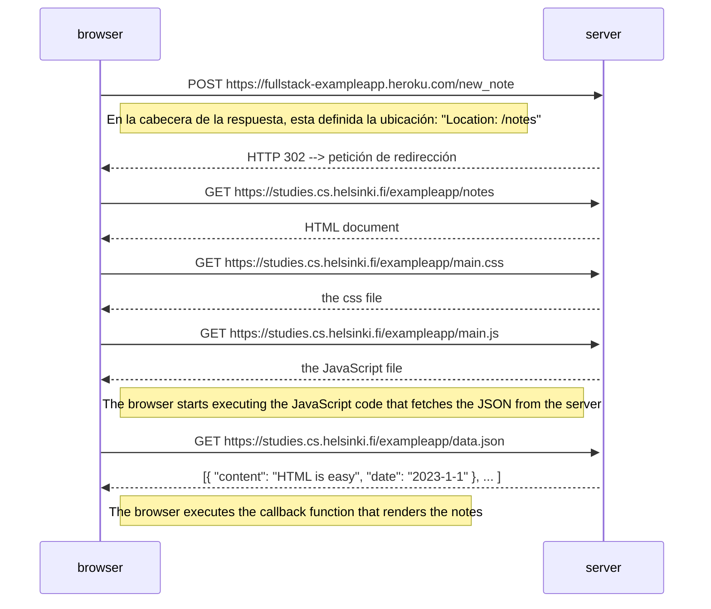

```mermaid
sequenceDiagram
    participant browser
    participant server

    browser->>server: POST https://fullstack-exampleapp.heroku.com/new_note
    activate server
    Note right of browser: En la cabecera de la respuesta, esta definida la ubicación: "Location: /notes"
    server-->>browser: HTTP 302 --> petición de redirección

    browser->>server: GET https://studies.cs.helsinki.fi/exampleapp/notes
    activate server
    server-->>browser: HTML document

    browser->>server: GET https://studies.cs.helsinki.fi/exampleapp/main.css
    activate server
    server-->>browser: the css file

    browser->>server: GET https://studies.cs.helsinki.fi/exampleapp/main.js
    activate server
    server-->>browser: the JavaScript file

    Note right of browser: The browser starts executing the JavaScript code that fetches the JSON from the server

    browser->>server: GET https://studies.cs.helsinki.fi/exampleapp/data.json
    activate server
    server-->>browser: [{ "content": "HTML is easy", "date": "2023-1-1" }, ... ]

    Note right of browser: The browser executes the callback function that renders the notes
```