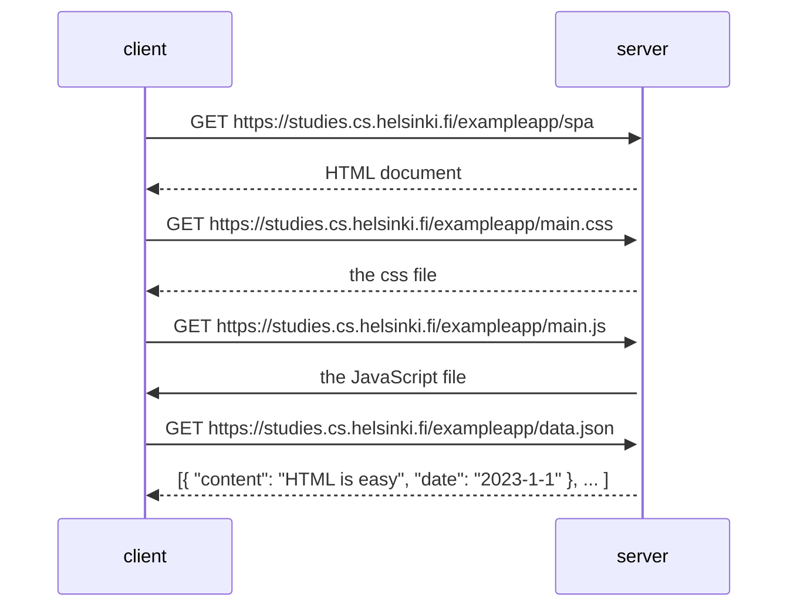

```mermaid
sequenceDiagram
  participant client
  participant server

  client->>server: GET https://studies.cs.helsinki.fi/exampleapp/spa
  activate server
  server-->>client: HTML document

  client->>server: GET https://studies.cs.helsinki.fi/exampleapp/main.css
  activate server
  server-->>client: the css file

  client->>server: GET https://studies.cs.helsinki.fi/exampleapp/main.js
  activate server
  server->>client: the JavaScript file

  client->>server: GET https://studies.cs.helsinki.fi/exampleapp/data.json
  activate server
  server-->>client: [{ "content": "HTML is easy", "date": "2023-1-1" }, ... ]
```
